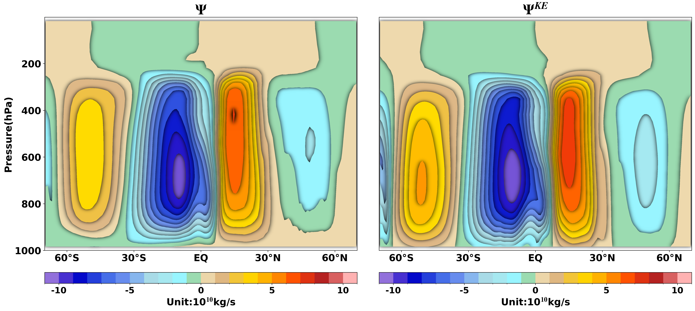

# KuoEliassen: Kuo-Eliassen Circulation Solver

[](https://badge.fury.io/py/KuoEliassen)
[](https://pypi.org/project/KuoEliassen/)
[](https://pypi.org/project/KuoEliassen/)
[](https://github.com/QianyeSu/KuoEliassen/actions/workflows/test-coverage.yml)
[](https://codecov.io/gh/QianyeSu/KuoEliassen)
[](https://github.com/QianyeSu/KuoEliassen/actions/workflows/build-wheels.yml)
[](https://github.com/QianyeSu/KuoEliassen)
[](https://opensource.org/licenses/BSD-3-Clause)
[](https://www.python.org/downloads/)

A high-performance, production-ready solver for the **Kuo-Eliassen equation** describing meridional atmospheric circulation forced by diabatic heating and eddy fluxes. Combines optimized Fortran 90 backend with intuitive Python interface.

## The Kuo-Eliassen Equation

The Kuo-Eliassen equation governs the zonal-mean meridional mass streamfunction response to forcing. This is an elliptic partial differential equation relating the streamfunction to diabatic heating and eddy momentum/heat flux convergences.

### Governing Equation

The compact form of the Kuo-Eliassen equation:

$$\frac{f^2 g}{2\pi a \cos\phi} \frac{\partial^2\psi}{\partial p^2} + \frac{S^2 g}{2\pi a} \frac{\partial}{\partial\phi}\left[\frac{1}{a\cos\phi}\frac{\partial\psi}{\partial\phi}\right] = D$$

**Complete expanded form** (RHS fully decomposed):

$$
\begin{aligned}
& f^2 \frac{g}{2\pi a\cos\phi} \frac{\partial^2\psi}{\partial p^2}
  + S^2 \frac{g}{2\pi a} \frac{\partial}{\partial\phi}\left[\frac{1}{a\cos\phi}\frac{\partial\psi}{\partial\phi}\right] \\
&= \frac{R}{p}\left(\frac{1}{a}\frac{\partial\overline{Q}}{\partial\phi}
  - \frac{1}{a}\frac{\partial}{\partial\phi}\left[\frac{1}{a\cos\phi}\frac{\partial(\overline{v'T'}\cos\phi)}{\partial\phi}\right]\right) \\
&\quad + f\left(\frac{1}{a\cos^2\phi}\frac{\partial^2(\overline{u'v'}\cos^2\phi)}{\partial p\\,\partial\phi}
  - \frac{\partial\overline{X}}{\partial p}\right)
\end{aligned}
$$

**Operator form** (alternative notation):

$$\mathcal{L}[\psi] = D$$

where the elliptic operator $\mathcal{L}$ is defined as:

$$\mathcal{L}[\psi] = \frac{f^2}{2\pi a \cos\phi} g\frac{\partial^2}{\partial p^2} + \frac{S^2 g}{2\pi a \cos\phi} \frac{\partial}{\partial \phi}\left[\frac{1}{a\cos\phi}\frac{\partial}{\partial \phi}\right]$$

**Component breakdown** of RHS:

$$D = \underbrace{\frac{R}{p a}\frac{\partial\overline{Q}}{\partial\phi}}_{\text{Diabatic Heating}} - \underbrace{\frac{R}{pa}\frac{\partial}{\partial\phi}\left[\frac{1}{a\cos\phi}\frac{\partial(\overline{v'T'}\cos\phi)}{\partial\phi}\right]}_{\text{Eddy Heat Flux}} + \underbrace{\frac{f}{a\cos^2\phi}\frac{\partial^2(\overline{u'v'}\cos^2\phi)}{\partial p\,\partial\phi}}_{\text{Eddy Momentum}} - \underbrace{f\frac{\partial\overline{X}}{\partial p}}_{\text{Friction}}$$

**Meridional velocity diagnostic**:

$$\bar{v} = -\frac{1}{a}\frac{\partial\psi}{\partial p}$$

**Vertical velocity diagnostic** (from continuity):

$$\bar{\omega} = -\frac{1}{a\cos\phi}\frac{\partial(\psi\cos\phi)}{\partial\phi}$$

where:
- **ψ** — meridional mass streamfunction [kg/s]
- **f = 2Ω sin(φ)** — Coriolis parameter [s⁻¹]
- **Ω** — Earth's rotation rate = 7.29 × 10⁻⁵ [rad/s]
- **a** — Earth's radius ≈ 6.371 × 10⁶ [m]
- **φ** — latitude [rad]
- **p** — pressure [Pa]
- **g** — gravitational acceleration ≈ 9.81 [m/s²]
- **S²** — static stability [s⁻²]
- **R** — specific gas constant ≈ 287 [J/(kg·K)]
- **$\overline{Q}$** — zonal-mean diabatic heating rate [K/s]
- **$\overline{v'T'}$** — meridional eddy heat flux [K·m/s]
- **$\overline{u'v'}$** — eddy momentum flux [m²/s²]
- **$\overline{X}$** — friction/dissipation function [K/s]
- Overbars represent zonal and monthly mean, and primes represent deviations from zonal and montly mean

### Static Stability

The static stability parameter $S^2$ characterizes atmospheric resistance to vertical motion and is defined as:

$$S^2 = -\frac{1}{\rho\theta}\frac{\partial\theta}{\partial p}$$

Alternatively, in terms of absolute temperature:

$$S^2 \approx \frac{g}{T}\left(\frac{\partial T}{\partial p} + \frac{g}{c_p}\right)$$

where:
- **ρ** — air density [kg/m³]
- **θ** — potential temperature [K]
- **T** — absolute temperature [K]
- **c_p** — specific heat at constant pressure ≈ 1005 [J/(kg·K)]
- **g** — gravitational acceleration ≈ 9.81 [m/s²]
- $\frac{\partial\theta}{\partial p}$ — vertical potential temperature gradient [K/Pa]
- $\frac{\partial T}{\partial p}$ — vertical absolute temperature gradient [K/Pa]

### Example Solution

The solver produces meridional streamfunction fields that reveal Hadley and Ferrel cell circulations:

<div align="center">
  
  <p><i>Meridional mass streamfunction and Kuo-Eliassen equation solution</i></p>
</div>

## Features

- **Optimized Fortran Backend**: Core solver implemented in production-grade Fortran 90 with advanced numerical methods
- **Component Decomposition**: Separate diagnostic contributions from latent heating, radiative heating, eddy heat flux, and eddy momentum flux
- **Flexible Interface**: NumPy and xarray-compatible APIs for seamless integration with scientific workflows
- **Cross-Platform Support**: Pre-built wheels for Windows, macOS (Intel & Apple Silicon), and Linux
- **Extensively Tested**: >90% code coverage with comprehensive test suite
- **High Performance**: Optimized SOR (Successive Over-Relaxation) iterative solver with configurable convergence criteria
- **Physical Accuracy**: Proper handling of poles, static stability, and geometric singularities

## Installation

### From PyPI (Recommended)

Pre-built binary wheels are available for Python 3.9-3.13 on all major platforms:

```bash
pip install kuoeliassen
```

No compiler required! Wheels are provided for:
- **Linux**: x86_64 (manylinux_2_28)
- **macOS**: x86_64 (Intel) and arm64 (Apple Silicon)
- **Windows**: x86_64

### From Source (Development)

If you want to contribute or modify the code:

1. **Prerequisites**: Install a Fortran compiler
   - Windows: `conda install -c conda-forge gcc-gfortran -y`
   - macOS: `brew install gcc`
   - Linux: `sudo apt-get install gfortran` (Ubuntu/Debian)

2. **Clone and install**:
   ```bash
   git clone https://github.com/QianyeSu/KuoEliassen.git
   cd KuoEliassen
   pip install -e .
   ```

See [DEVELOPMENT.md](DEVELOPMENT.md) for detailed development instructions.

## Quick Start

### Basic Usage: Solve for Streamfunction

```python
import numpy as np
import xarray as xr
from kuoeliassen import solve_ke

# Load atmospheric data from NetCDF file
data = xr.open_dataset("example_data.nc")

# Extract variables from dataset
# Assuming dimensions are (time, pressure, latitude)
v = data['v'].values                    # Mean meridional wind [m/s]
temperature = data['temperature'].values  # Temperature field [K]
vt_eddy = data['vt_eddy'].values        # Eddy heat flux v'T' [K⋅m/s]
vu_eddy = data['vu_eddy'].values        # Eddy momentum flux u'v' [m²/s²]
diabatic_heating = data['diabatic_heating'].values  # Total heating [K/s]

# Extract coordinate arrays (must be 1D)
pressure = data['pressure'].values      # Pressure levels [Pa]
latitude = data['latitude'].values      # Latitude [degrees]

# Solve Kuo-Eliassen equation for each time step
result = solve_ke(
    v, temperature, vt_eddy, vu_eddy,
    pressure, latitude,
    heating=diabatic_heating
)

# Access results
psi_total = result['PSI']               # Total streamfunction [kg/s]
psi_d = result['D']                     # Total RHS forcing
```

### Component Decomposition: Isolate Individual Forcings

```python
# Separate radiative and latent heating contributions
result = solve_ke(
    v_mean, temperature, vt_eddy, vu_eddy, pressure, latitude,
    rad_heating=rad_heating,        # Radiative heating [K/s]
    latent_heating=latent_heating   # Latent heating from convection [K/s]
)

# Examine component-wise circulation response
psi_total = result['PSI']          # Total circulation
psi_rad = result['PSI_rad']        # Radiative forcing response
psi_latent = result['PSI_latent']  # Latent heating response
psi_vt = result['PSI_vt']          # Eddy heat flux response
psi_vu = result['PSI_vu']          # Eddy momentum flux response
```

### Using xarray for Labeled Data

```python
import xarray as xr
from kuoeliassen import solve_ke_xarray

# Load your atmospheric data (must have pressure and latitude dimensions)
ds = xr.open_dataset('atmospheric_data.nc')

# Solve with automatic coordinate handling
result_ds = solve_ke_xarray(
    ds['v_mean'], ds['temperature'], ds['vt_eddy'], ds['vu_eddy'],
    heating=ds['heating'],
    pressure_dim='pressure', latitude_dim='latitude'  # Specify if needed
)

# Result is an xarray Dataset with proper coordinates and attributes
psi = result_ds['PSI']
print(psi)  # Full metadata preserved
psi.plot()  # Easy visualization
```


## Platform Support

| Platform | Python Versions | Architecture | Status |
|----------|----------------|--------------|--------|
| Linux    | 3.9 - 3.13     | x86_64       | ✅ Tested |
| macOS    | 3.9 - 3.13     | x86_64       | ✅ Tested |
| macOS    | 3.9 - 3.13     | arm64 (M1/M2)| ✅ Tested |
| Windows  | 3.9 - 3.13     | x86_64       | ✅ Tested |

## Requirements

- **Python**: ≥ 3.9
- **NumPy**: ≥ 1.24.0
- **SciPy**: ≥ 1.7.0
- **xarray**: ≥ 0.19.0 (optional, for labeled array interface)

### Development Requirements

For building from source, you'll need:
- A Fortran compiler: `gfortran`, `ifort`, or `flang`
- Meson build system
- NumPy's f2py (included with NumPy)

## License

This project is licensed under the BSD-3-Clause License - see the [LICENSE](LICENSE) file for details.

## Citation

If you use KuoEliassen in your research, please cite:

```bibtex
@software{kuoeliassen2025,
  author = {Su, Qianye},
  title = {KuoEliassen: High-Performance Kuo-Eliassen Circulation Solver},
  year = {2025},
  url = {https://github.com/QianyeSu/KuoEliassen}
}
```


## Contact

- **Author**: Qianye Su
- **Email**: suqianye2000@gmail.com
- **Repository**: https://github.com/QianyeSu/KuoEliassen
- **Issue Tracker**: https://github.com/QianyeSu/KuoEliassen/issues

For questions, bug reports, or feature requests, please open an issue on GitHub.

## Acknowledgments & References

This solver implements the Kuo-Eliassen equation, a fundamental tool in atmospheric dynamics for understanding meridional circulation:

- **Kuo, H.-L.** (1956). Three-dimensional equations of motion with small Rossby number. *Physics of Fluids*, 1(4), 290-299.
- **Eliassen, A.** (1951). Slow thermally or frictionally controlled meridional circulation in a circular vortex. *Astrophysica Norvegica*, 5, 19-60.
- **Edmon, H. J., et al.** (1980). The effects of a time-varying climatic forcing on the dynamics of the stratosphere. *J. Atmos. Sci.*, 37, 1234-1254.

The numerical implementation employs:
- **SOR (Successive Over-Relaxation)** iterative solver for the elliptic operator
- **Centered finite differences** for spatial derivatives with pole-aware boundary handling
- **Fortran 90** for high performance and portability